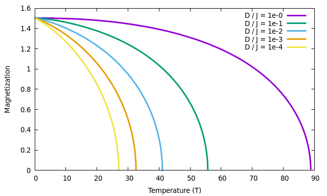
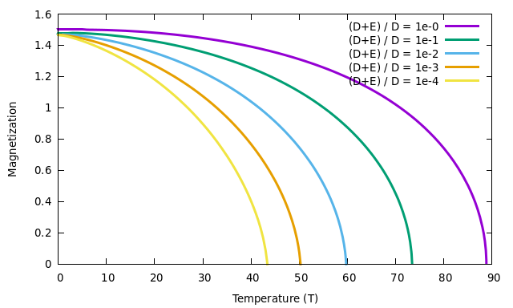

# Magnetization_Generalized-Tyablikov
This Julia code computes temperature-dependent magnetization of a 2D orthorhombic spin-3/2 ferromagnet with two sublattices (e.g., CrSBr), described by the following (quantum) spin Hamiltonian:
```math
H = \sum_{ij}J_{ij}{\bf S}_i{\bf S} _j -D\sum_{i}(S^z_i)^2 + E\sum_{i}\left[(S^y_i)^2-(S^x_i)^2\right],
```
where the first term is the Heisenberg term with $J _{ij}$ being the isotropic exchange interaction between lattice sites $i$ and $j$ with spins $S_i$ and $S_j$. The second and third term
describe single-ion anisotropy (SIA) arising from the spin-orbit coupling (SOC) and characterized by the parameters $D$ and $E$.
The anisotropic exchange interactions are not considered in the Hamiltonian. If the dipole-dipole interaction is neglected, one can distinguish between the following qualitatively different cases:
* $D>0$ and $|E| < D$: Easy-axis magnet with the easy axis along $z$;
* $D>0$ and $E=-D$: Easy-plane magnet with y-z being the easy plane.

The Hamiltonian written above is solved using the Green's function technique using Tyablikov decoupling for intersite spin operators, and Anderson-Callen decoupling for the on-site spin operators. Technically, the problem boils down to a solution of $n=4\cdot S=6$ coupled integral equations for spin correlation functions, one of which corresponds to the magnetization (e.g., $\langle S_z \rangle$). These equations are solved intependently for each temperature.
If $z$ is the quantization axis (as implemented in the code), the magnon dispersion relation is given by the expression
```math
E^{\pm}({\bf q}) = \sqrt{ \left[\omega_0^{\pm}({\bf q}) + 2D\Phi \langle S_z \rangle \right]^2 - \left[2E\Phi \langle S_z \rangle \right]^2 },
```
which includes two branches for a two-sublattice ferromagnet. Here, 
```math
\omega^{\pm}_0({\bf q}) = 2\langle S_z \rangle \left[ J_{11}({\bf 0}) + J_{12}({\bf 0}) - J_{11}({\bf q}) \pm J_{12}({\bf q}) \right] 
```
is the isotropic contribution to the dispersion with $J_{ij}({\bf q})$ being the Fourier transform of the exchange interaction matrix, and
```math
\Phi = 1 - \frac{1}{2S^2}[S(S+1) - \langle (S_z)^2 \rangle ]
``` 
is the Anderson-Callen decoupling function. In the two limiting cases one has:
* $D>0$ and $E=0$ (easy axis): $E^{\pm}({\bf q}) = \omega_0^{\pm}({\bf q}) + 2D\Phi \langle S_z \rangle$ that is $E^{-}({\bf q}) \sim q^2$ at ${\bf q} \rightarrow 0$
* $D>0$ and $E=-D$ (easy plane): $E^{\pm}({\bf q}) = \sqrt{\omega_0^{\pm}({\bf q})} \sqrt{\omega_0^{\pm}({\bf q}) + 2D\Phi \langle S_z \rangle}$ that is $E^{-}({\bf q}) \sim q$ at ${\bf q} \rightarrow 0$

The qualitative difference between the spin-wave behavior at long wavelengths turns out to be crucial for the stabilization of magnetic ordering in these two cases.

## Examples
Figures below show calculated dependence of the magnetization as a function of the Hamiltonian parameters.

- Easy-axis spin-3/2 magnet _isotropic_ in the $xy$ plane, $J=1$ meV, $E=0$.



In the limit of an isotropic 2D magnet, $D/J \rightarrow 0$, one can see that the critical temperature $T_C$ approaces zero. Moreover, this dependence is logarithmic, $T_С \sim 1/\mathrm{ln}(J/D)$, that is extremely slow, ensuring finite $T_C$ even for very small anisotropy $D/J$.

- Easy-axis spin-3/2 magnet, _anisotropic_ in the $xy$ plane, $J=1$ meV, $D=1$ meV.



Again, in the limit of an easy-plane magnet, $E \rightarrow -D$, one has $T_С \rightarrow 0$.

### References
* P. Fröbrich and P.J. Kuntz, "Many-body Green's function theory of Heisenberg films", Phys. Rep. 432, 223 (2006)
* L. Hu, H. Li, and R. Tao, "Effects of interplay of dipole-dipole interactions and single-ion easy-plane anisotropy of two-dimensional ferromagnets", Phys. Rev. B 60, 10222 (1999)
* A.N. Rudenko, M. Rösner, and M.I. Katsnelson, "Dielectric tunability of magnetic properties in orthorhombic ferromagnetic monolayer CrSBr", npj Comput. Mater. 9, 83 (2023)
